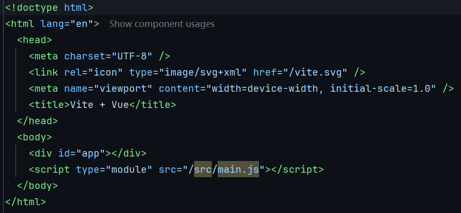
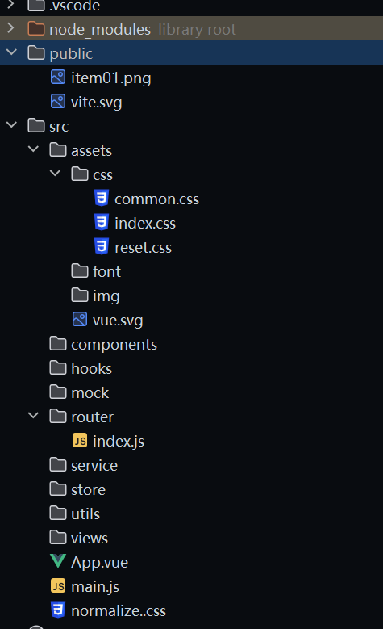

### 完了，说的是使用 vant 组件库进行开发，但是自己抽离的公共组件有点小多了
* 但是有很多的组件的自己封装当前还不行，欢迎来自各路的神仙大佬帮助封装一哈
* 主要进行修改的地方是 src/components :
  * Loading 封装不同样式的数据请求过程中的加载界面的组件集
  * slider 就是自定义封装的轮播图的组件
  * tab-bar 就是自定义封装的导航控制栏的组件
* 在提交 pr 的时候，一定需要考虑组件的可复用性
  * 熟练的使用 **插槽slot | 组件通信 | composition api | promise** 
  * 同时也是可以使用 ts 重构代码，或者说使用**文档注释替代 ts 也是可以的**
* **:heart: :heart: :heart:**

## 项目初始化流程
* **首先选择使用什么脚手架**
  * 这个脚手架可以自己配置或者说直接使用官方的
* **然后进行项目配置**
  * 配置整个项目的 icon/svg 图标配置
    * 就是在我们的根 html 中进行配置即可
  * 配置项目标题
  * 配置项目的 js/tsconfig.json，从而实现 vscode 的提示提高
    * 我 webstorm 用户，打死不配置，哈哈哈，让vscode 用户难受
* **CSS 样式的重置**
  * reset.css 自动逸重置样式
  * common.css 自定义设置的公共样式
  * normalize.css  github开源直接下载或者 cv 即可
  * 并且使用在 main.js 中进行导入生效
* 解决图片引入问题
  * 就是使用我们的 URL 对象来实现的是我们的解决引入问题
```javascript
const getAssetImgURL = (imageUrl) => {
    return new URL(imageUrl, import.meta.url).href
}
```




## 项目业务逻辑分层搭建
* **assets** 存放的是我们的整个项目的静态资源
  * css/img/font
* **components** 存放的是公共开发使用的组件
  * common 是多个项目都需要进行使用到的组件
  * content 是当前项目需要使用的公共组件
* **hooks**
  * 就是提取的是我们的公共的 JS/TS 代码逻辑
* **mock**
  * 前端开发人员自己手动模拟的数据
  * 用来解决前后端分离，但是前端只能
  * 等待后端接口开发好的时间等待的缺点
* **router**
  * 配置的是项目的路由，实现单页面的开发
* **service**
  * 存放网络请求代码
* **store**
  * 开发的是项目的状态管理库
* **utils**
  * 抽取的整个项目公共使用的一些工具
* **views**
  * 就是开发的是我们每个页面的详情信息
  * 也就是我们常说的路由组件



## 推荐搭建移动端 vant-ui 组件库的使用
* Vant 的使用
  * `npm install vant`
  * 这个就是一个组件库
    * 基本上所有的组件库都是可以实现我们的全局引入以及按需引入的
    * 以及还可以实现自动引入该组件库
  * 该组件库是一个用来打造我们的一个移动端项目的时候使用的一个组件库，专用于 vue 框架开发的
* [vant 组件库的官网](https://vant-ui.github.io/vant/#/zh-CN)
  * `npm i vant`
  * `npm i @vant/auto-import-resolver unplugin-vue-components unplugin-auto-import -D`
  * 下载所需要的插件
  * 同时配置我们的 vite.config.js
    * 不同的环境之下，vant 的配置官网还是十分清晰的，自行配置即可
    * 搭建属于自己的移动端应用吧

### 开发思想
* 通过配置路由 mate 信息来实现控制组件的显示
  * 然后结合获取激活状态的路由的 useRoute 来实现获取信息即可
  * 或者说通过我们的样式设计来实现是一样的呐
* 通过 geo api 来实现获取用户的位置信息
  * 获取得到的信息是我们的经纬度，同时数据传递给后端，后端返回信息
  * 然后我们渲染页面


**注意在我们的实际的开发中，我们实现发送网络请求的时候，地方不要是我们的，每一个小组件中。尽量在状态管理或者说大组件中发送网络请求**
**同时实际上的话前端的开发和后端的开发的目录结构实际上是很相似的**
**前端的每一个路由和后端的路由关系大致相对的**
**前端的每一个组件进行请求数据的时候，都是进行的是我们的对后端对应接口发送的请求，获取数据，解析数据，渲染数据**


### 如何开发属于自己的组件库
* 在自己封装组件库的时候可以使用插槽来实现的，slot 含有**无名插槽和具名插槽**
* 同时在自己进行开发的时候，即使是 vue 不推荐操作 DOM ，但是这个时候我们不得不进行操作 DOM 来实现一些操作的
  * 关于操作 DOM 操作可以定义在我们的 hooks 中的，自定义 hooks ，这就是 vue3 和 react 高度吻合的一个点了
  * **前端莫得ui，做开发废一半，后端和前端莫得产品，前后端交互规范废一半，但是需要优秀的产品存在才是真理**
* 同时利用好算法: 冒泡排序 | 快速排序 | 希尔排序 | 堆排序等等
  * 基础组件
  * 表单组件
  * 反馈组件
  * 展示组件
  * 导航组件
  * 业务组件

* 在进行自己封装组件的时候，我们是可以实现的是多利用 offsetTop | clientTop | scrollTop 这些 DOM 属性来进行操作的
* 同时还有一些 token 的获取，上面的这些相关的 DOM 操作我们是必不可少的，这样的情形只能使用 DOM 的
* **postcss-px-to-viewport**
  * `npm install postcss-px-to-viewport -D`
  * viewport 布局
  * 该工具的配置可以快捷的帮助我们适配移动端设备，开发人员在开发的时候只是需要进行 px 书写代码即可
* `npm run build` 进行的是打包项目，生成 dist 文件，**distrbution**