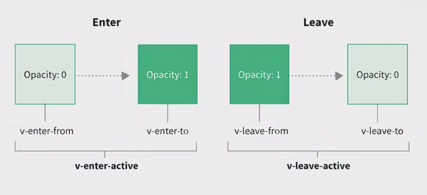

### vue 中实现过渡动画效果
* 就是实现的是我们的在一个特定的实际为我们的元素添加一些类来实现最终的动画效果的
  * 不是代表默认就添加好了的动画效果的
  * 这些类名是固定的
* 具体实现的思路就是
  * 我们通过这些类名的书写后，**手动的添加这些类**
  * 同时还可以使用 vue **内置的组件实现我们的在恰当的时间自动的添加这些类**
    * transition | transition-group
  * 实现使用我们的动画是为了我们的页面更加的顺畅，更加复合人们的视觉享受

#### 简单使用
```vue
<script setup>
  import {ref} from "vue"
  const isShow = ref(true)
  const eleClick = () => {
    isShow.value = !isShow.value
  }
</script>

<template>
  <div class="animation01">
    <transition>
      <div v-show="isShow">
        hello world
      </div>
    </transition>
    <button @click="eleClick">切换显示</button>
  </div>
</template>

<style scoped lang="less">
  // 这些内置的属性含有我们的离开以及进入的实现

  // 开始进入的时候
  .v-enter-from, .v-leave-to {
    opacity: 0;
  }

  // 进入后的效果
  .v-enter-to, .v-leave-from {
    opacity: 1;
  }

  // 效果实现
  .v-enter-active, .v-leave-active {
    transition: opacity 0.1s ease-in;
  }
</style>
```

#### 动画过渡内置的class
* `.v-enter-from`
  * 定义的就是我们的元素从什么的状态进行进入页面的
* `.v-enter-to`
  * 就是我们的动画需要达到的最终效果
* `v-enter-active`
  * 就是指定我们需要执行怎样的动画
* 同理的是还具备我们的 
  * **v-leave-from** 
  * **v-leave-to** 
  * **v-leave-active**
  * **v-move** 表示的就是我们的移动的时候该具备的动画效果


#### 内置属性的更多细节
* 我们在使用内置的过渡组件的时候，我们是可以给 transition 提供 name 属性的
  * 如果不提供属性的话，就是默认的是 name="v"
    * 这个时候属性就是我们的 v-enter-active
  * 如果实现了添加了我们的name 属性后，name="jwz"
    * 这个时候我们的动画类名可以为: jwz-enter-active
* 我们的动画效果含有我们的 transition 或者 animation 
  * 这个时候我们是可以设置 **type** 属性的在 transition 组件上
  * 通常不要设置，内置了自动检测的
* 还可以显示的指定我们的时间 duration
* 过渡模式 **mode** 的设置
  * 这个时候可以实现的多个动画之间的替换模式的设置
    * in-out | out-in
  * 决定的就是谁先谁后
* appear 属性就是实现的是我们的首次也具备动画效果

* transition-group 实现的就是我们的给列表实现添加动画效果

`<transition name="jwz" type="transition" :duration="1" appear>content</transition>`

该部分主要的就是掌握我们的 transition 以及 transition-group 的基本使用，以及其中含有的一些细节